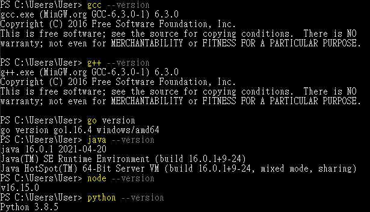
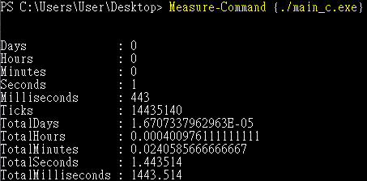
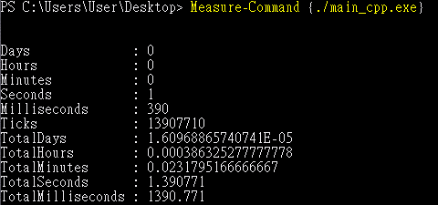
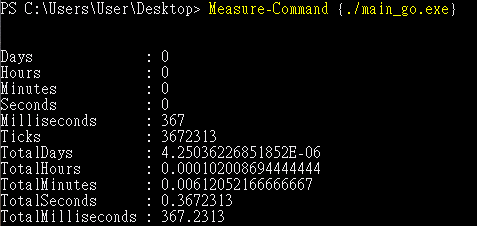
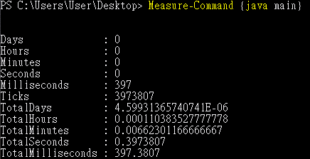
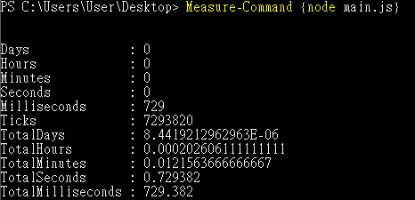
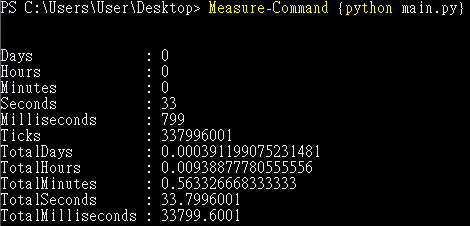
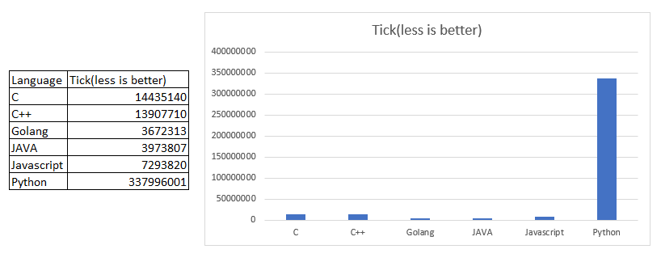

# Loop_Speed_Test
This Repository is a loop speed test on each most popular programming language.

---

## Programming Languages in This Test

- C
- C++
- Golang
- JAVA
- JavaScript
- Python

---

## Structure of The Code

Declare a function/method named ‘time’, it runs 1 billion times addition and returns the result. In the main function/method, it just calls time function/method and print it.

This is an example code in C language. Others codes are the same structure like it.

```c
#include <stdio.h>

long long time(void){
  long long x=0;
  for(long long i=0;i<1000000000;i++){
    x=x+i;
  }
  return(x);
}

int main(void){
  printf("%lld",time());
}
```

---

## Result

The testing environment hardware is:

| Type | Value |
|------|-------|
| CPU  | AMD Ryaen 7 Pro 4750G at 3.60GHz |
| RAM  | 32G |


The operating system is Windows 10 Pro 21H2:

| Environment | Version |
|-------------|---------|
| GCC | GCC-6.3.0-1 |
| G++ | GCC-6.3.0-1 |
| Go | go1.16.4 windows/amd64 |
| JRE | build 16.0.1+9-24 |
| Node.js | v16.15.0 |
| Python3 | 3.8.5 |



| Language | Screenshot |
|----------|------------|
| C |  |
| C++ |  |
| Golang |  |
| JAVA |  |
| JavaScript |  |
| Python |  |

---

## Summary

The unit of tick is 100nS.
This time, the fastest language is built golang, only about 367mS to run 1 billion times integer addition loops. 
And the Slowest one, as always, is python. It spends about 33.799 seconds to finish 1 billion times integer addition loops.
But this is a little bit not fair to python. Because only python and javascript are not compiled.
Surprisingly, javascript on Node.js is very well, because even it is not compiled, the runtime still faster than compiled c/c++. That is incredible!



| Top 3 Winner | It's Name |
|--------------|-----------|
| 1 |  |
| 2 |  |
| 3 |  |
